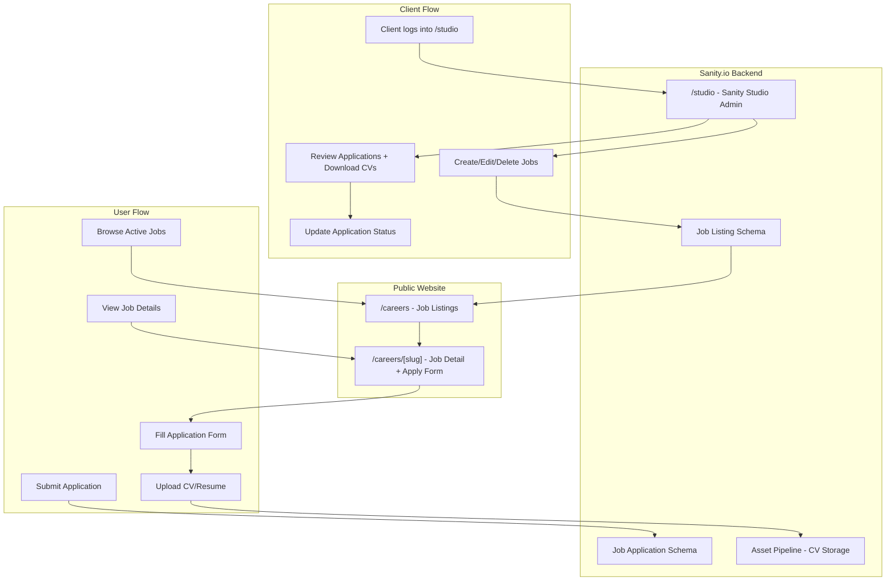
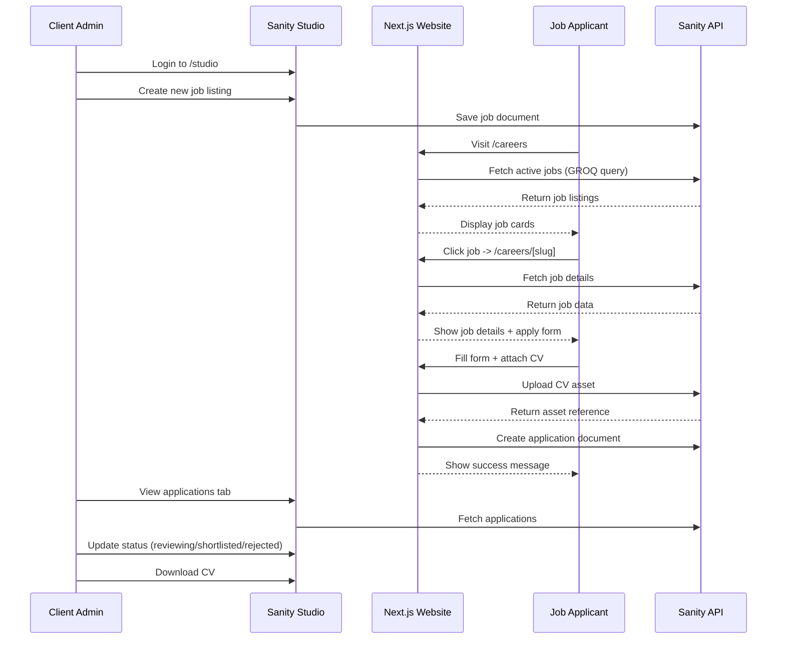

---

use this coupon code when starting up the sanity for this project
--coupon javascriptmastery2022
name: Yejzila Careers Page
overview: Add a careers system to the Yejzila Next.js website using Sanity.io as the backend CMS, enabling the client to create/manage job listings and review applications, while users can browse jobs and apply with CV uploads.
todos:
    - id: sanity-setup
      content: Initialize Sanity project, configure sanity.config.ts, embed Sanity Studio at /studio route in Next.js
      status: pending
    - id: schemas
      content: Create jobListing, jobApplication, and blockContent schemas with all fields and validation
      status: pending
    - id: careers-listing
      content: Build /careers page with GROQ queries to fetch active jobs, job cards grid, and filters (department, location, type)
      status: pending
    - id: job-detail
      content: Build /careers/[slug] page with full job details, requirements, responsibilities, and embedded ApplicationForm
      status: pending
    - id: application-form
      content: Build ApplicationForm component with fields (name, email, phone, cover letter, LinkedIn) + CV file upload using Sanity asset pipeline
      status: pending
    - id: api-route
      content: Create POST /api/applications route to handle form submission, upload CV to Sanity assets, and create application document
      status: pending
    - id: studio-customization
      content: Customize Sanity Studio with desk structure for easy application review -- group applications by job, add status filters, enable CV download
      status: pending
isProject: false
---

# Yejzila Careers Page Architecture

## Why Sanity.io over Firebase

**Sanity.io is the clear winner for this use case because:**

1. **Built-in Admin UI (Sanity Studio)** -- Your client gets a polished, ready-made dashboard to create jobs and review applications without you building a custom admin panel. With Firebase, you'd need to build an entire admin dashboard from scratch.
2. **Content-first design** -- Job listings are structured content, which is exactly what Sanity excels at.
3. **File/asset handling** -- CV uploads are handled natively through Sanity's asset pipeline.
4. **Embeddable in Next.js** -- Sanity Studio can live at `/studio` inside the existing Next.js app.
5. **Free tier** -- 100K API requests/month, 1GB assets, 10GB bandwidth -- more than enough.
6. **No auth system to build** -- Sanity handles admin authentication out of the box.

## System Architecture



## Application Flow



## Pages to Build

| Route | Purpose | Type |
| ----- | ------- | ---- |

- `**/careers**` -- Grid of active job listings with filters (department, location, type). Server-rendered via Sanity GROQ queries.
- `**/careers/[slug]**` -- Full job description + requirements + responsibilities + application form with CV upload.
- `**/studio/[[...tool]]**` -- Sanity Studio embedded as a Next.js route. Client accesses this to manage everything.

## Sanity Schemas

### 1. Job Listing Schema (`jobListing`)

```typescript
// sanity/schemas/jobListing.ts
{
  name: 'jobListing',
  title: 'Job Listing',
  type: 'document',
  fields: [
    { name: 'title', type: 'string' },           // "Senior Procurement Officer"
    { name: 'slug', type: 'slug' },               // Auto-generated from title
    { name: 'department', type: 'string' },        // "Oil & Gas", "Mining", "Energy"
    { name: 'location', type: 'string' },          // "Port Harcourt, Nigeria"
    { name: 'employmentType', type: 'string' },    // "Full-time", "Part-time", "Contract"
    { name: 'description', type: 'blockContent' }, // Rich text
    { name: 'requirements', type: 'array' },       // List of requirements
    { name: 'responsibilities', type: 'array' },   // List of responsibilities
    { name: 'salaryRange', type: 'string' },       // Optional: "Competitive" or range
    { name: 'deadline', type: 'datetime' },         // Application deadline
    { name: 'isActive', type: 'boolean' },          // Toggle visibility
    { name: 'postedAt', type: 'datetime' },         // Auto-set on publish
  ]
}
```

### 2. Job Application Schema (`jobApplication`)

```typescript
// sanity/schemas/jobApplication.ts
{
  name: 'jobApplication',
  title: 'Job Application',
  type: 'document',
  fields: [
    { name: 'fullName', type: 'string' },
    { name: 'email', type: 'string' },
    { name: 'phone', type: 'string' },
    { name: 'coverLetter', type: 'text' },
    { name: 'resume', type: 'file' },              // CV upload
    { name: 'linkedinUrl', type: 'url' },           // Optional
    { name: 'jobListing', type: 'reference', to: [{ type: 'jobListing' }] },
    { name: 'status', type: 'string',               // "new" | "reviewing" | "shortlisted" | "rejected"
      options: { list: ['new', 'reviewing', 'shortlisted', 'rejected'] }
    },
    { name: 'appliedAt', type: 'datetime' },
  ]
}
```

## API Routes (Next.js)

- `**POST /api/applications**` -- Handles form submission + CV upload to Sanity. This runs server-side so the Sanity write token stays hidden from the client.

## New Dependencies

```bash
npm install next-sanity @sanity/client @sanity/image-url sanity @sanity/vision
```

## File Structure (new files only)

```
yejzila/
  sanity/
    sanity.config.ts          # Sanity project config
    sanity.cli.ts              # CLI config
    schemas/
      index.ts                 # Schema exports
      jobListing.ts            # Job listing schema
      jobApplication.ts        # Application schema
      blockContent.ts          # Rich text schema
  app/
    careers/
      page.tsx                 # Job listings grid
      [slug]/
        page.tsx               # Job detail + apply form
    studio/
      [[...tool]]/
        page.tsx               # Sanity Studio (admin)
    api/
      applications/
        route.ts               # POST handler for applications
  components/
    careers/
      JobCard.tsx              # Job listing card component
      ApplicationForm.tsx      # Application form with CV upload
      JobFilters.tsx           # Department/location/type filters
```

## What the Client Gets

1. **Sanity Studio at `/studio`** -- A clean, intuitive admin panel where she can:

- Create, edit, and deactivate job listings with rich text formatting
    - View all applications organized by job listing
    - Filter applications by status (new, reviewing, shortlisted, rejected)
    - Update application statuses
    - Download CVs directly
    - No technical knowledge required

1. **Auto-populating careers page** -- Any job she publishes in Studio immediately appears on the website.

## Implementation Order

The tasks below follow a logical dependency chain -- Sanity setup first, then content schemas, then pages, then the application flow.
